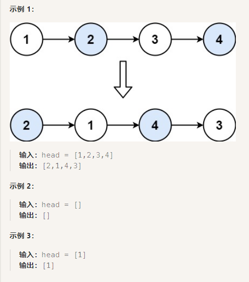

# 24. 两两交换链表中的节点(swap-nodes-in-pairs)

[代码随想录文档链接](https://www.programmercarl.com/0024.%E4%B8%A4%E4%B8%A4%E4%BA%A4%E6%8D%A2%E9%93%BE%E8%A1%A8%E4%B8%AD%E7%9A%84%E8%8A%82%E7%82%B9.html#%E7%AE%97%E6%B3%95%E5%85%AC%E5%BC%80%E8%AF%BE)

[力扣题目链接](https://leetcode.cn/problems/swap-nodes-in-pairs/description/)

题意：给你一个链表，两两交换其中相邻的节点，并返回交换后链表的头节点。你必须在不修改节点内部的值的情况下完成本题（即，只能进行节点交换）。



## 1. 基本法SWAP
```c++
/**
 * Definition for singly-linked list.
 * struct ListNode {
 *     int val;
 *     ListNode *next;
 *     ListNode() : val(0), next(nullptr) {}
 *     ListNode(int x) : val(x), next(nullptr) {}
 *     ListNode(int x, ListNode *next) : val(x), next(next) {}
 * };
 */
class Solution {
public:
    ListNode* swapPairs(ListNode* head) {
        ListNode *dummyHead = new ListNode(0); // 设置一个虚拟头节点
        dummyHead->next = head; // 将虚拟头节点指向head，便于后续删除操作
        ListNode *cur = dummyHead; 
        while(cur->next != nullptr && cur->next->next != nullptr){ // 循环终止条件，对奇偶数节点进行判断
            ListNode *tmp = cur->next; // 记录临时节点 节点断开处需要记录保存
            ListNode *tmp1 = cur->next->next->next; 

            cur->next = cur->next->next; // 步骤一
            cur->next->next = tmp; // 步骤二
            cur->next->next->next = tmp1; // 步骤三

            cur = cur->next->next; // cur移动两位，准备下一轮交换
        }

        return dummyHead->next;
    }
};
```
## 2.递归法

## 3.双指针法