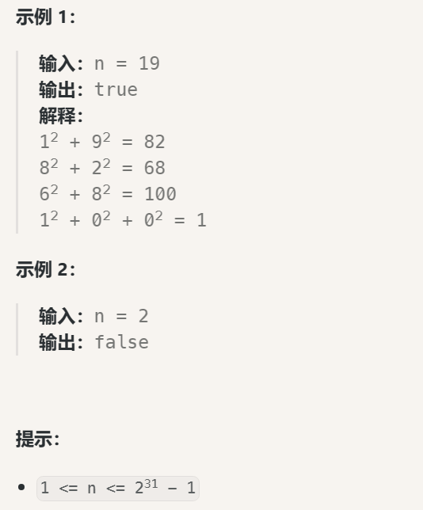

# 202.快乐数

[代码随想录文档链接](https://www.programmercarl.com/0202.%E5%BF%AB%E4%B9%90%E6%95%B0.html#%E6%80%9D%E8%B7%AF)

[力扣题目链接](https://leetcode.cn/problems/happy-number/description/)
编写一个算法来判断一个数 n 是不是快乐数。

「快乐数」 定义为：

对于一个正整数，每一次将该数替换为它每个位置上的数字的平方和。
然后重复这个过程直到这个数变为 1，也可能是 无限循环 但始终变不到 1。
如果这个过程 结果为 1，那么这个数就是快乐数。
如果 n 是 快乐数 就返回 true ；不是，则返回 false 。


## 1.使用哈希数据结构：unordered_set

```cpp
class Solution {
public:
    int getSum(int n){ // 求数n各个位上的平方和
        int sum = 0;
        while(n){
            sum+=(n % 10) * (n % 10);
            n/=10;
        }
        return sum;
    }
    bool isHappy(int n) {
        unordered_set<int> set; // 定义哈希结构，用于判断无限循环
        while(1){
            int sum = getSum(n);
            if(sum == 1){
                return true;
            }
            // 如果这个sum曾经出现过，说明已经陷入了无限循环了，立刻return false
            if(set.find(sum) != set.end()){ // 这里判断是否等于end是因为find函数找不到就会返回end
                return false;
            }
            else{
                set.insert(sum);
            }
            n = sum;
        }
    }
};
```